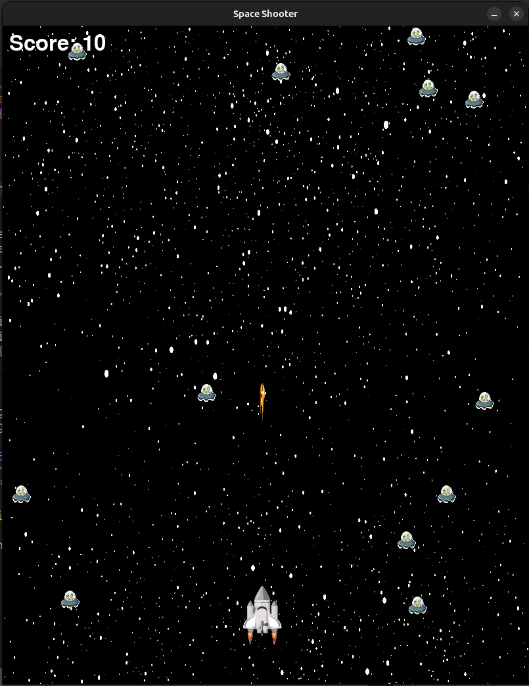

# 🎮 **Space Shooter** 🎮

Welcome to **Space Shooter**! Dive into an exhilarating world of fun and excitement, where your skills and quick thinking will be put to the ultimate test! Whether you're a casual gamer or a hardcore enthusiast, this game has something for everyone. Ready to embark on an unforgettable adventure? Let's get started!

---

## 🚀 **Game Overview**

- **Genre**: Action-Shooter
- **Platform**: PC
- **Gameplay**: Single-player

---

## 🌟 **Features**

- **Engaging Combat**: Face off against ferocious monsters in dynamic combat.
- **Beautiful Soundtrack**: Enjoy an original soundtrack that sets the tone for your adventure.

---

## 🎮 **Controls**

- **PC Controls**:

  - **Keyboard Arrows**: Move
  - **Space**: Fire

---

## 🎉 **How to Contribute**

We’d love for you to get involved in the development of **Space Shooter**! If you find any bugs, want to suggest features, or simply want to help improve the game, feel free to open an issue or pull request.

- **Fork the repository**
- **Clone it to your local machine**
- **Create a branch**
- **Make your changes**
- **Submit a pull request**

---

## 🔥 **Screenshots / Demo**

Here are some sneak peeks of the game in action:



---

## 🛠️ **Installation**

1. **Clone the repository**:

   ```bash
   git clone https://github.com/prakashtaz0091/space-ship-alien-battle.git
   ```

2. **Create a virtual environment and activate it**:

   - If you're using windows:

   ```bash
   python3 -m venv venv
   source venv/bin/activate
   ```

   - If you're using linux or mac:

   ```bash
   python3 -m venv venv
   source venv/bin/activate
   ```

3. **Install requirements**:

   ```bash
   pip install -r requirements.txt
   ```

4. **Run the game**:
   ```bash
   python game.py
   ```

---

## 📜 **License**

This game is licensed under the MIT License. See the [LICENSE](LICENSE) file for more information.

---

Happy gaming, and good luck on your adventure! 🎮✨

---
